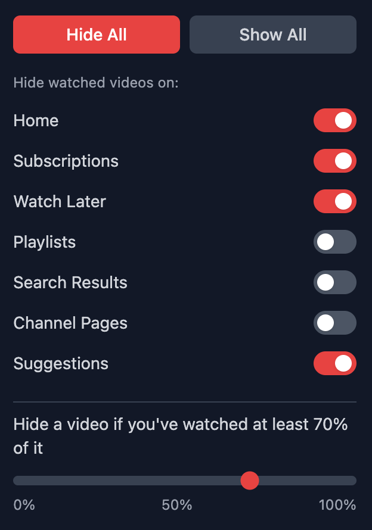

<p align="center">
  
</p>

<h3 align="center">Seen It</h2>
<p align="center">A browser extension that allows you to hide YouTube videos you've already watched.</p>

---

### Download

- [Firefox](https://addons.mozilla.org/en-US/firefox/addon/seen-it/)
- Chrome (awaiting approval)

### Features

- Toggle to show/hide previously watched videos
- Adjustable watch percentage threshold (Hide a video if you've watched at least `x`% of it)
- Works on YouTube home, search, subscriptions, and channel pages
  <br />
  <br />
  

### Setup

```bash
bun install
```

```bash
bun run build
```

### Loading the Extension

#### Chrome

1. Open `chrome://extensions/`
2. Enable "Developer mode" (toggle in top right)
3. Click "Load unpacked"
4. Select `dist/chrome`

#### Firefox

1. Open `about:debugging`
2. Go to "This Firefox"
3. Click "Load temporary addon"
4. Select the `manifest.json` file inside `dist/firefox`
